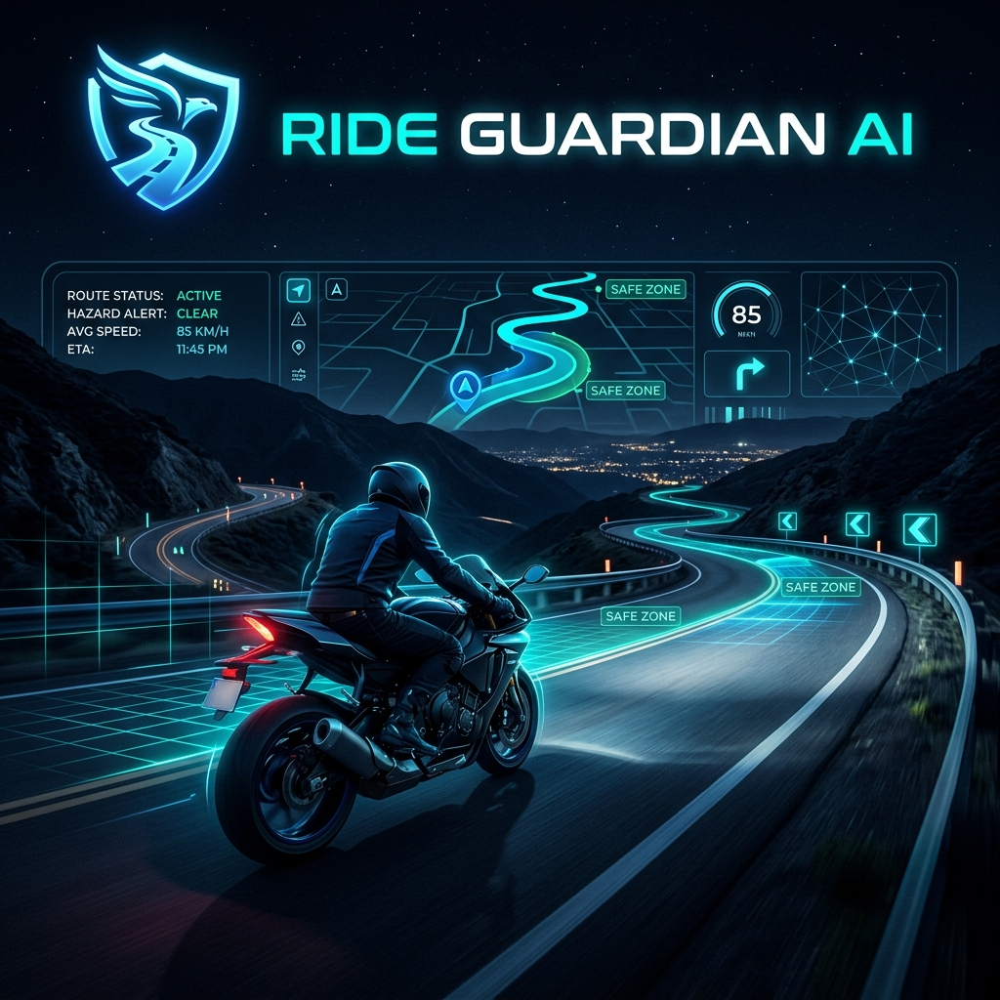
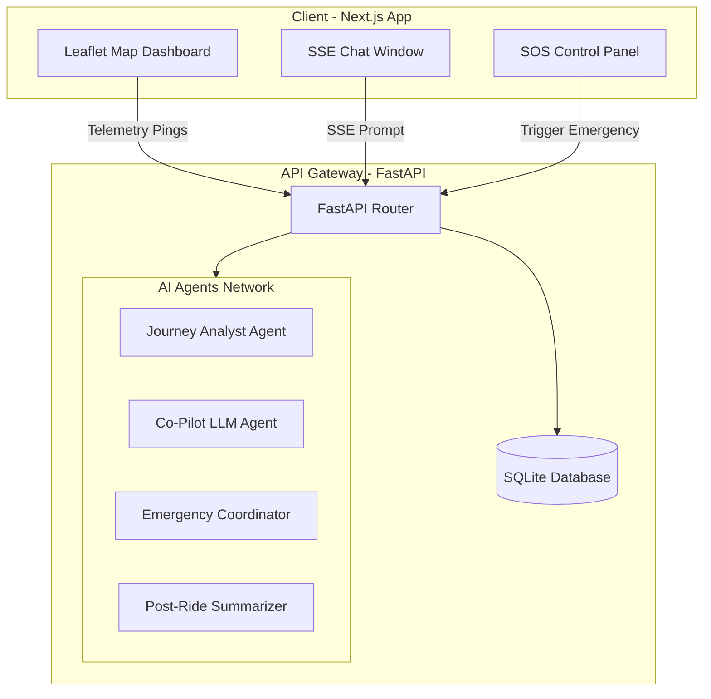

# RideGuardian AI 🛡️🏍️
> **Autonomous Safety Co-Pilot for Solo Travelers & Adventurers**



RideGuardian AI is a sophisticated, real-time safety companion and co-pilot designed specifically for solo travelers, motorcyclists, and road trippers. Utilizing specialized AI agents, RideGuardian AI acts as a digital sentinel—evaluating environmental hazards before you ride, serving as an interactive voice and chat co-pilot while on the go, tracking telemetry to detect anomalies, and coordinating multi-channel emergency protocols in critical events.

---

## 🌟 Key Features

### 1. 🗺️ Journey Risk Analyst Agent
Before setting off, RideGuardian AI evaluates your route using custom AI risk analysis models:
- **Vehicle Optimization**: Inputs specifications like motorcycle type, tank capacity, and fuel mileage to plan safe refueling windows.
- **Dynamic Terrain & Hazard Scoring**: Scans the route for topography, weather conditions, visibility risk factors, and road-type complexities.
- **Narrative Safety Briefing**: Generates a detailed risk profile and actionable safety advice for the route ahead.

### 2. 💬 Co-Pilot Chat Assistant (Real-Time SSE Streaming)
A responsive conversational partner that helps keep the rider alert and informed:
- Uses **Server-Sent Events (SSE)** for ultra-fast, word-by-word streaming responses.
- Allows you to log checkpoint updates, report weather shifts, or query safety information hands-free.
- Automatically accesses database logs of your current journey state to offer context-aware suggestions.

### 3. 🚨 Sentinel Emergency Coordinator
A safety net for when you need it most, monitoring telemetry anomalies and coordinating crisis mitigation:
- **Multi-Source Triggers**: Detects critical incidents via inactivity timers, sudden crash telemetry, or manual SOS buttons.
- **Emergency Contact Notification**: Instantly drafts alerts and dispatches details to pre-configured In-Case-of-Emergency (ICE) contacts.
- **Medical Dispatch Assistance**: Queries and geo-locates the nearest hospital relative to the rider's last known coordinates, providing direct dispatch intelligence.

### 4. 📝 Post-Ride Summary Generator
Synthesizes your travel accomplishments:
- Compiles travel telemetry, safety events, and checkpoints into an engaging, structured travelogue.
- Identifies ride achievements and challenges for future journey planning.

---

## 🛠️ System Architecture

RideGuardian AI is built with a decoupled client-server architecture:



### Tech Stack
- **Frontend**: Next.js, React, TypeScript, Tailwind CSS, Leaflet.js
- **Backend**: Python, FastAPI, SQLite, Uvicorn, LangChain / LLM Orchestration

---

## 🚀 Getting Started

### 📋 Prerequisites
- **Python 3.10+**
- **Node.js 18+**
- GitHub account credentials (pre-authenticated with GitHub CLI)

---

### 🔧 Backend Installation & Setup

1. **Navigate to the backend directory**:
   ```bash
   cd backend
   ```

2. **Create and activate a virtual environment**:
   ```bash
   python -m venv venv
   # On Windows:
   .\venv\Scripts\activate
   # On macOS/Linux:
   source venv/bin/activate
   ```

3. **Install dependencies**:
   ```bash
   pip install -r requirements.txt
   ```

4. **Environment Variables**:
   Copy `.env.example` in the root to `.env` inside the backend directory, and populate the keys:
   ```bash
   # Add your LLM provider API keys here
   OPENAI_API_KEY=your_openai_api_key
   ```

5. **Start the API Server**:
   ```bash
   python run.py
   ```
   The backend API will be available at `http://localhost:8000`. You can inspect the interactive OpenAPI docs at `http://localhost:8000/docs`.

---

### 💻 Frontend Installation & Setup

1. **Navigate to the frontend directory**:
   ```bash
   cd ../frontend
   ```

2. **Install node dependencies**:
   ```bash
   npm install
   ```

3. **Configure Environment Variables**:
   Copy `.env.local` configurations and ensure the backend URL points to the running FastAPI server:
   ```env
   NEXT_PUBLIC_API_URL=http://localhost:8000
   ```

4. **Run the local development server**:
   ```bash
   npm run dev
   ```
   Open `http://localhost:3000` in your browser to view the interactive RideGuardian AI map dashboard and safety console.

---

## 📁 Repository Structure

```text
Ride-Guardian-AI/
├── backend/
│   ├── app/
│   │   ├── agents/          # AI agents for analyst, copilot, emergency, summary
│   │   ├── routers/         # FastAPI endpoint modules (journey, chat, emergency, user)
│   │   ├── database.py      # SQLite operations and scheme initialization
│   │   ├── main.py          # FastAPI application bootstrap
│   │   └── config.py        # Environment variables configuration
│   ├── requirements.txt     # Python packages
│   └── run.py               # Backend development runner
├── frontend/
│   ├── src/
│   │   ├── app/             # Next.js App router (pages, layout, globals)
│   │   ├── components/      # UI components (LeafletMap, ChatWindow, Dashboard)
│   │   └── lib/             # API client utilities
│   ├── package.json         # Node scripts & dependencies
│   └── tailwind.config.ts   # Style definitions
├── banner.png               # AI-generated horizontal theme banner
├── .gitignore               # Main repository ignore file
└── README.md                # System documentation (this file)
```

---

## 🔒 Security & Safety Disclaimers
*RideGuardian AI is a safety co-pilot assistant. Telemetry detection and AI-coordinated hospital routing are assistive features. Always prioritize active road awareness and standard local emergency services (e.g., 911) during road emergencies.*
